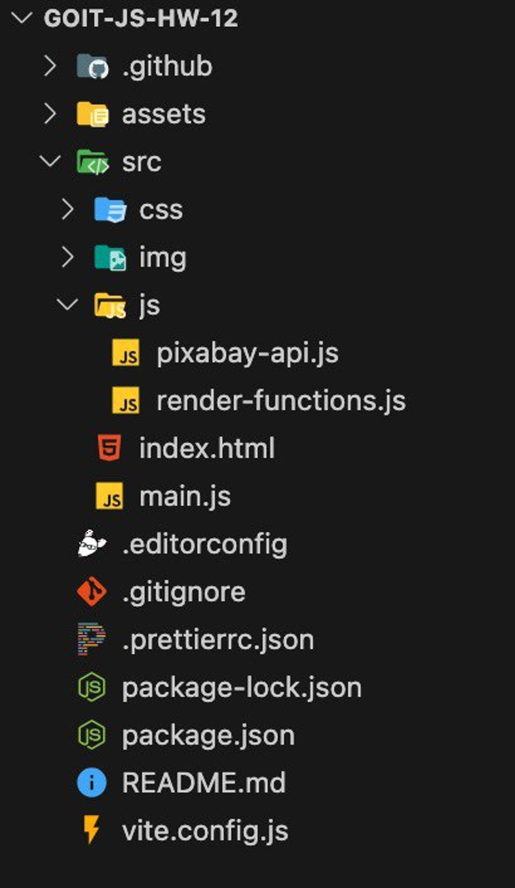

# Create the repository `goit-advancedjs-hw-04`

Build the project using Vite. We have prepared a ready-made build with all the
additional project settings for you and recommend using it.

Use the axios library for HTTP requests.

Use async/await syntax.

Read the task and complete it in the code editor.

Make sure that the code is formatted with Prettier and that there are no errors
or warnings in the console when opening the live page of the task.

Submit the homework for review.

For code organization, use modularity and export/import syntax:

In the `pixabay-api.js` file, store the functions for performing HTTP requests:

`getImagesByQuery(query, page)`. This function must accept two parameters:
`query` (a search word, which is a string) and `page` (a page number, which is a
number), perform an HTTP request, and return the value of the `data` property
from the received response.

In the `render-functions.js` file, create a SimpleLightbox instance for working
with the modal window and store the functions for displaying interface elements:

`createGallery(images)`. This function must accept an array of `images`, create
HTML markup for the gallery, add it to the gallery container, and call the
`refresh()` method of the SimpleLightbox instance. It returns nothing.

`clearGallery()`. This function accepts nothing and must clear the contents of
the gallery container. It returns nothing.

`showLoader()`. This function accepts nothing and must add a class to display
the loader. It returns nothing.

`hideLoader()`. This function accepts nothing and must remove a class to display
the loader. It returns nothing.

`showLoadMoreButton()`. This function accepts nothing and must add a class to
display the Load more button. It returns nothing.

`hideLoadMoreButton()`. This function accepts nothing and must remove a class to
display the Load more button. It returns nothing.

In the `main.js` file, write all the logic of the application. Calls to iziToast
notifications, all checks for the length of the array in the received response,
and the page scrolling logic (`scroll`) are done exactly in this file. Import
the functions from the `pixabay-api.js` and `render-functions.js` files into it
and call them at the appropriate moment.

## Task. Image Search

Use the code from the previous homework and add new functionality to the image
search application.

## Refactoring

Add the Axios library to the project for working with HTTP requests and refactor
the code by replacing the use of fetch with it.

Use async/await syntax for working with asynchronous requests. Refactor your
code.

## Pagination

Pixabay API supports pagination and provides the `page` and `per_page`
parameters. Make it so that each response when searching for images contains 15
objects (20 by default).

The initial value of the `page` parameter must be `1`.

With each subsequent request, it must be increased by `1`.

When searching by a new keyword, the `page` value must be reset to the initial
value, since pagination will be for a new collection of images.

Add the markup of a button with the text `Load more` to the HTML document after
the gallery. When clicking it, a request for the next group of images must be
performed and the markup must be added to the already existing gallery elements.
To do this, when submitting the form, you need to save what the user entered
into a global variable.

While there are no images in the gallery, the button must be hidden.

After images appear in the gallery, the button appears in the interface under
the gallery.

When submitting the form again, the button is hidden first, and after receiving
the request results, it is displayed again if needed.

Move the loading indicator under the button for loading additional images.

## End of Collection

In the response, the backend returns the `totalHits` property — the total number
of images that match the search criterion (for a free account). If the user has
reached the end of the collection, hide the Load more button and display a
message with the text
`"We're sorry, but you've reached the end of search results."`.

## Page Scrolling

Make smooth page scrolling after the request and rendering of each next group of
images. To do this, get the height of one gallery card in the code using the
`getBoundingClientRect` function. After that, use the `window.scrollBy` method
to scroll the page by two gallery card heights.

## What the Mentor Will Pay Attention to During the Review

The homework contains two links: to the source files and the live page on GitHub
Pages, as well as the attached repository file in ZIP format.

The project is built using Vite.

The console in the developer tools does not contain errors, warnings, or console
logs.

The elements on the page are styled according to the layout (or with custom
styles).

The project contains code from the previous homework.

The `pixabay-api.js` file has the `getImagesByQuery(query, page)` function for
performing HTTP requests.

The `render-functions.js` file has a SimpleLightbox instance created and
contains functions for displaying interface elements: `createGallery(images)`,
`clearGallery()`, `showLoader()`, `hideLoader()`, `showLoadMoreButton()`,
`hideLoadMoreButton()`.

The `main.js` file contains all the application logic.

All asynchronous requests are refactored and implemented using async/await
syntax.

One request returns 15 elements in the response.

New images are added to the DOM in one operation.

The page contains a Load more button under the gallery, and clicking it sends a
request for the next page.

After adding new elements to the image list, the `refresh()` method is called on
the SimpleLightbox instance.

When the user receives results for the maximum possible page for a specific
search word, that is, there is nothing more to load, the Load more button
disappears and the corresponding message appears.

With every new form submit, the page number is reset to the default value `1`,
and the results of previous requests disappear.

When clicking a small image in the gallery, its enlarged version opens in a
modal window using the SimpleLightbox library.
